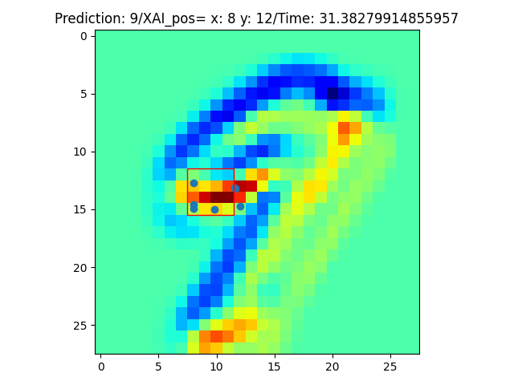
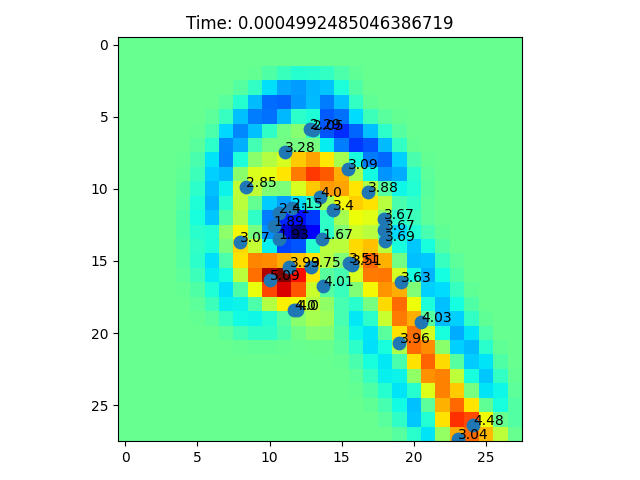

# Attetion Maps Feature - Usage #

## Usage - Latest changes - 24th June ##

### 1 - Options to change the attention tf-keras-vis technique to retrieve the heatmaps. ###

Go to `attention_maps.py` and change the variable `Attention_Technique` (line 44).

Choose one of the 2 options below:

```python
Attention_Technique = "Faster-ScoreCAM"
Attention_Technique = "Gradcam++"
```
OBS: Solving some bugs with the gradcam technique.

### 2 - Change the method to find the SVG_path points with more attention score. ###

Go to `mutation_manager.py` and change the variable `attention_mth` (line 36).

Choose one of the 2 options below:

* `Method 1`: Moving window (3x3) to find the max attention area in the heatmap and returns all the points inside the window. 

```python
attention_mth = 1
```
* `Method 5`: For each SVG_path point, calculate the attention score of the corresponding pixel and returns the n (2) points with more attention scores. (Based on Andreas suggestion).

```python
attention_mth = 5
```

To change the number of points to return, go to mutation_manager.py line 42 and change the second argument of the function:

```python
list_of_points_inside_square_attention_patch, elapsed_time = AM_get_attetion_svg_points_images_mth5(input_img, 2, svg_path)
```
### 3 - Mutation unit tests ###

To see how the mutation digits are looking like, you can run the commented script at the end of the `attention_maps.py` file (lines 638 to 670).
Instructions:

 1 - Uncomment the code
 
 2 - Create the results folder: "./mutant/"
 
 3 - Run `python attention_maps.py`

## Attetion Maps Feature - Installation ##

All the changes were made on the docker image using the same components installed in the Venv. Run Step1 to configure the enviroment.
The only new component to be installed is the tf-keras-vis. That can be installed running the following command:
## Step 2.1: Install   ##

```
$ pip install tf-keras-vis
```

## OUTDATED Functions Below - Please Ignore. ##


A new python file `attention_maps.py` was added to the directory. Inside this file, the main important functions to be used in the DeepJanus project are:
* `AM_get_attetion_svg_points_images_mth1`: This function will return a list containing the SVG path points located inside the square patch with more attention (sum of the attetion pixels inside the square patch). First, the function go through all the image summing the pixels inside the square patches and looking for the highest sum value. When it finds that area with maximum value, it will get all the SVG path points inside that area and return them in a list. 
  * ### Inputs: ###
    * `images`: A numpy array of the image to be processed with dimensions (x, 28, 28) where x>=1;
    * `x_patch_size`: The X size of the patch area for the sum of the attention pixels.
    * `y_patch_size`: The Y size of the patch area for the sum of the attention pixels.
    * `svg_path`: A string with the digit's SVG path description. Ex: "M .... C .... Z".
  * ### Outputs: ###
    * `list_of_ControlPointsInsideRegion`: A list containing the positions (tuples) of the SVG path points inside the max attention square patch.
    * `Elapsed time`: Elapsed time to run the function.
  * ### Illustration: ###
</img>

* `AM_get_attetion_svg_points_images_mth2`: This function will return a list containing the SVG path points and the respective weights for the random choice of a number in a non-unifiform distribution. Differently from the previous function, the sum of the attention pixels is performed only around the positions of the SVG path points (square patch). After saving the value of the attention maps for each SVG path point, the script will associate a weight for each point proportional to the value of the attention sum around their respective positions.
  * ### Inputs: ###
    * `images`: A numpy array of the image to be processed with dimensions (x, 28, 28) where x>=1
    * `sqr_size`: The size of the square patch which the sums of the attention pixels will be performed. Must be 3 or 5.
    * `model`: The model object to be used to predict to predict the digit's value.
  * ### Outputs: ###
    * `list_of_points_and_weights`: A list containing the positions (tuples) of the SVG path points and the respective non-uniform distribution weights.
    * `Elapsed time`: Elapsed time to run the function.
  * ### Illustration: ###
</img>

* ### Examples: ###
```python
#------------Example how to use------------#

from tensorflow import keras
from config import MODEL
from attention_maps import AM_get_attetion_svg_points_images_mth1, \
    AM_get_attetion_svg_points_images_mth2, \
    get_svg_path

# load the MNIST dataset
mnist = keras.datasets.mnist
(x_train, y_train), (x_test, y_test) = mnist.load_data()

model = keras.models.load_model(MODEL)

images = x_test[:2]
svg_path = get_svg_path(images[0]) #get_svg_path input should be an image (28,28)

print("Method1:\n")
list_of_points_inside_square_attention_patch, elapsed_time = AM_get_attetion_svg_points_images_mth1(images, 3, 3, svg_path)
print(list_of_points_inside_square_attention_patch,"\n", elapsed_time,"\n")

print("Method2:\n")
list_of_points_and_probalities, elapsed_time = AM_get_attetion_svg_points_images_mth2(images, 3, model)
print(list_of_points_and_probalities,"\n", elapsed_time,"\n")

````

