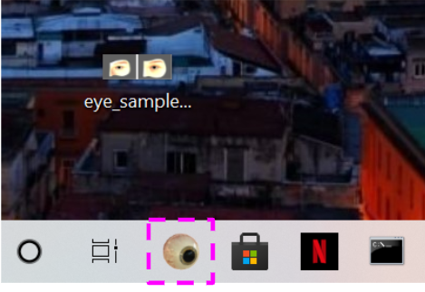
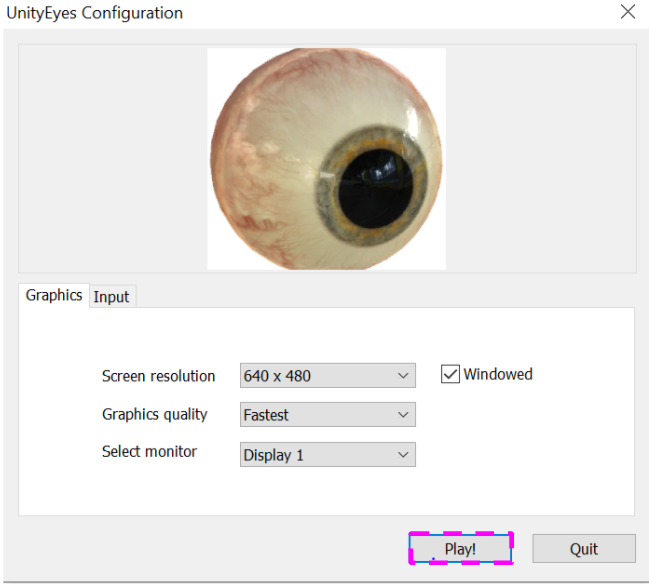
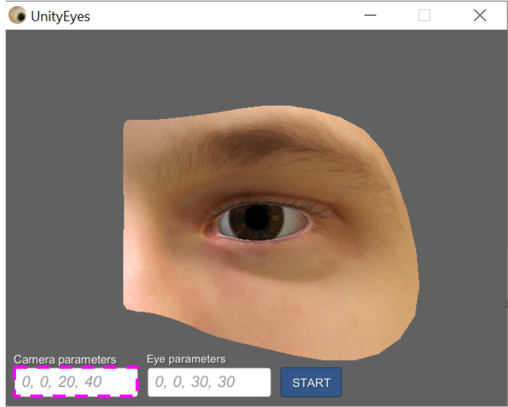
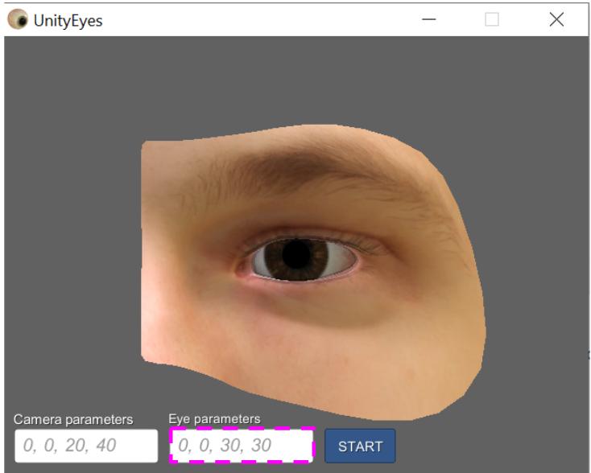
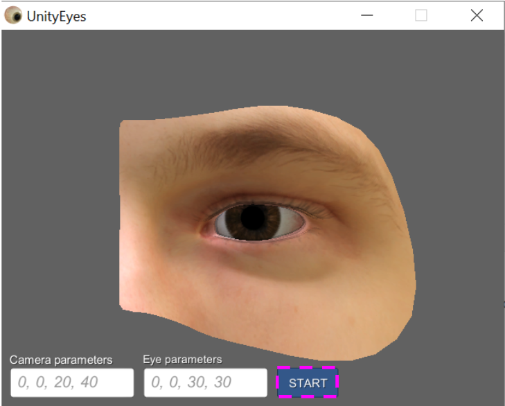
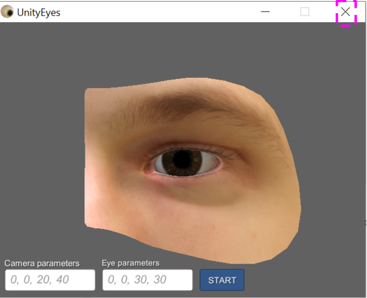

# Test Input Generator for UnityEyes #

## General Information ##
This folder contains the application of the DeepJanus approach to the eye gaze prediction problem on a real machine equipped with Windows 10. 

This tool is developed in Python on top of the DEAP evolutionary computation framework. It has been tested on a Windows machine equipped with a i9 processor, 32 GB of memory, and an Nvidia GPU GeForce RTX 2080 Ti with 11GB of dedicated memory.

### Step 1: Java Installation ###

Download and install [Java SE 11](https://www.oracle.com/it/java/technologies/javase-jdk11-downloads.html). Official instructions [here](https://docs.oracle.com/en/java/javase/11/install/installation-jdk-microsoft-windows-platforms.html).

### Step 2: Python Installation ###

Install [_Python 3.7.9_](https://www.python.org/ftp/python/3.7.9/python-3.7.9-amd64.exe)

Check that you are using the correct version of python:
``` 
py.exe -V
```
This command should produce as output the following string: `Python 3.7.9`

To easily install the dependencies with pip, we suggest to create a dedicated virtual environment. For example, you can use `venv` and create a virtual environment called `.venv` inside the current folder (`DeepMetis-UE`):

```
python -m venv .venv
```

At this point, you need to activate the virtual environment:

``` 
.\.venv\Scripts\activate
```


At this point, upgrade `pip`:

```
py.exe -m pip install --upgrade pip

```

Update setuptools:
```
pip install setuptools --upgrade

```

Finally, install the other dependencies:
```
pip install -r requirements.txt
```


### Step 3: UnityEyes Installation and Configuration ###

* Download a free Windows version of UnityEyes from the [official website](https://www.cl.cam.ac.uk/research/rainbow/projects/unityeyes/data/UnityEyes_Windows.zip).  
* Edit the UNITYEYES_PATH in [properties.py](properties.py) by inserting the path to your UnityEyes folder. 
* Pin the UnityEyes application to the taskbar: [instructions here](https://support.microsoft.com/en-us/windows/pin-apps-and-folders-to-the-desktop-or-taskbar-f3c749fb-e298-4cf1-adda-7fd635df6bb0)

### Step 4: SikuliX Installation and Configuration ###

The folder Sikuli-jars contains a version of SikuliX downloaded from the [official website](http://sikulix.com). We use it to allow the interaction of DeepMetis with UnityEyes via GUI. SikuliX works based on scanning the screen for particular elements to interact with, for example, an app icon to click on. Therefore, for each system the user should provide screenshots of GUI widgets to interact with. As screen resolutions and colours might differ from one computer to another, the screenshots we provide with our SikuliX scripts might not work on other computers. In the following, we will provide instructions on how to re-capture these images. To this aim, we provide the whole window along with the specific widget to crop, i.e. the one highlighted with a pink frame.

* In the taskbar, take a screenshot of the highlighted component (i.e., UnityEyes icon) and save it as eye.png



* Start UnityEyes and from the starting window take a screenshot of the highlighted component (i.e., play button) and save it as play.png



* Press the play button and from the main window take a screenshot of the highlighted component (i.e., first edit text widget) and save it as first.png



* From the UnityEyes' main window take a screenshot of the highlighted component (i.e., second edit text widget) and save it as second.png



* From the UnityEyes' main window take a screenshot of the highlighted component (i.e., start button) and save it as start.png



* From the UnityEyes' main window take a screenshot of the highlighted component (i.e., close window button) and save it as x.png



* Save all the captured images in the [sikulix_scripts/unityeyes.sikuli folder](sikulix_scripts/unityeyes.sikuli/)


> **NOTE**: We already provided examples of these images in the [sikulix_scripts/unityeyes.sikuli folder](sikulix_scripts/unityeyes.sikuli/) but you most probably have to replace them to match your own screen resolution.

* Run the Sikulix IDE in [Sikuli-jars/sikulixide-2.0.4.jar](Sikuli-jars/) (you can simply double click on it). It will automatically install the Jython standalone version.
* Open [sikulix_scripts/unityeyes.sikuli/unityeyes.py](sikulix_scripts/unityeyes.sikuli/unityeyes.py) inside the Sikulix IDE.
* Press the Run button to verify that the Sikulix script is able to find and interact with all the GUI widgets

> **NOTE**: If Sikulix cannot find a widget, please capture it again (try to focus on the element and capture pixels that will always be present around the element).

> **NOTE**: Please note that a computer should have a monitor connected for SikuliX to work. Please, also note that pop-up windows (such as the notification of a low battery) can disrupt the work of SikuliX.

### Step 5: Run DeepJanus

Open terminal and go in the directory where DeepJanus-UE is installed.
If you used a virtual environment, activate the virtual environment.

Use the following command to start the SikuliX server:

```
python test.py
```

Open another terminal instance and start a run of DeepJanus-UE:

```
python main.py
```

> NOTE: The user must not interact with the PC during the run

> NOTE: One run take up to 1 hour or more on a physical machine, depending on the hardware specifications of the machine.

At the end of the run, DeepJanus will create a folder `results` which contains: 
* the archive of solutions (`archive` folder); 
* the final report (`report_final.json`);
* the configuration's description (`config.json`).


